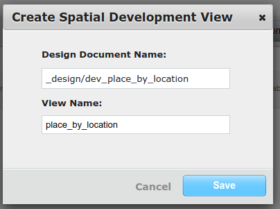
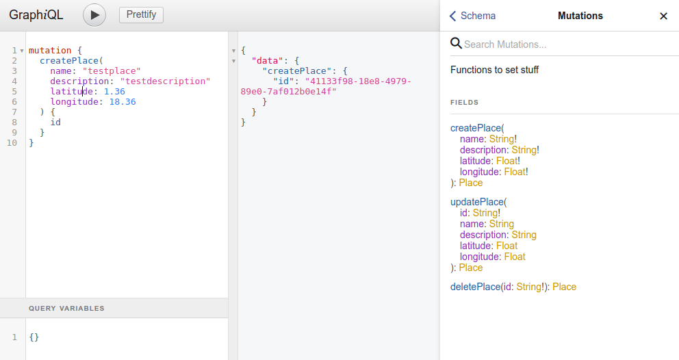
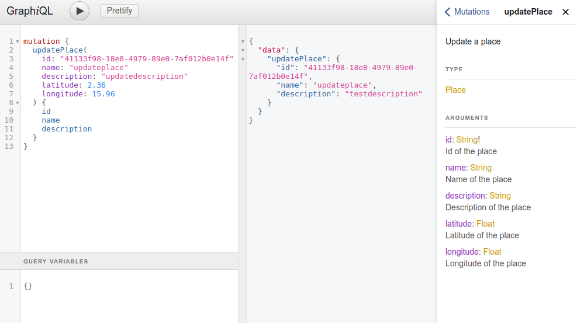
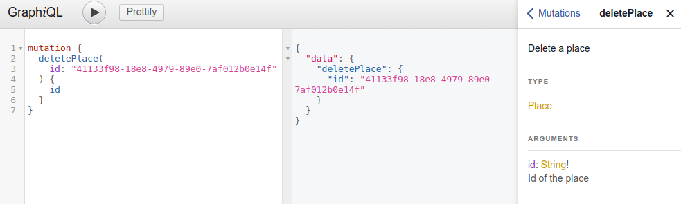
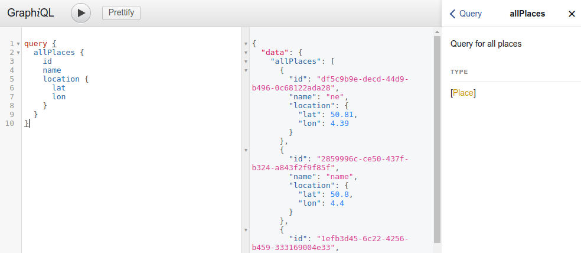
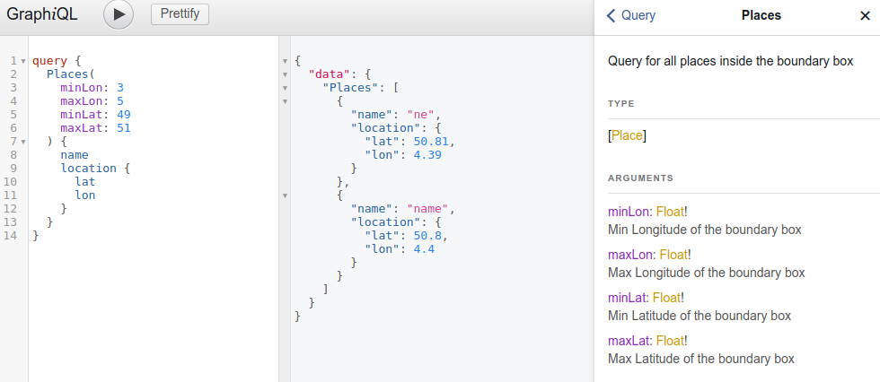
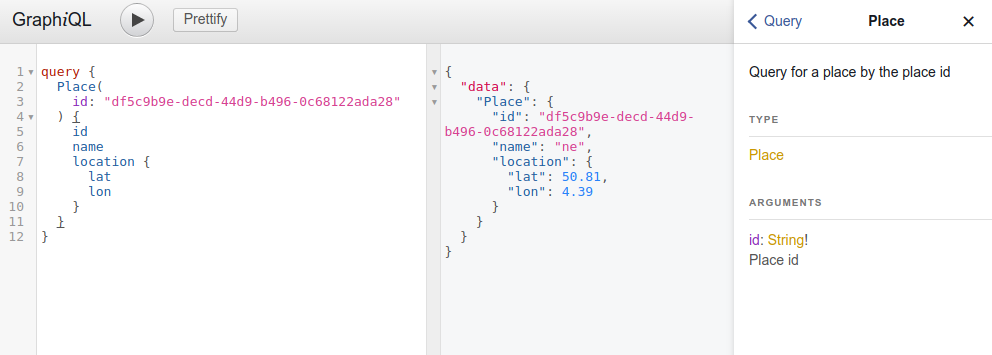

# node-couchbase-graphql
Graphql server with nodejs, express, couchbase, ottoman

## Introduction
We are going to develop a [Graphql](http://graphql.org/) server in nodejs with express.
Graphql is a query language for APIs, and it help us to fetch only the data that we define avoiding overfetching.
With the server we are going to query and create *Places*.
To store the data we are going to use couchbase and we are going to use Spartial views to query the Places by its geographical location.
I wrote a previous [post](https://blog.couchbase.com/2017/february/develop-a-rest-api-with-couchbase-ottoman-nodejs-hapijs) about node and couchbase, so I will skip the configuration of the db that I wrote in the previous post.

## Requirements
You need to have installed in your computer:
- nodejs
- couchbase server
You can find the code in the [github repo](https://github.com/jmn8718/node-couchbase-graphql.git).

## Spatial View
First of all we need to create the spartial view.
We go to the admin page, in my case http://localhost:8091/ and log in with my user and password.
Then click on **Data Buckets** and create a bucket, i called it *graphql*.
After that we click on **View**, then we click on **Create Development Spartial View**, and we type the values.

I used *place_by_location* in both **Design Document Name** and **View Name**. Now click on **edit**, and add the following code
```
function (doc) {
  if (doc._type === 'Place' && doc.location) {
    emit([{
      "type": "Point",
      "coordinates": [doc.location.lon, doc.location.lat]
    }], doc);
  }
}
```
and click on **Save**.
Here you can also test the view with the documents on the bucket.

## Place Model
For our places, we are going to store the name of the place and a description as string.
Like we want to use the SpartialView that couchbase provide as, we are going to store the location of the place in an object called *location* where we are going to store the latitude and longitude.
Also we will set by default the created date when we add the place.
```
const PlaceModel = ottoman.model('Place', {
  name: 'string',
  description: 'string',
  location: {
    lat: 'number',
    lon: 'number'
  },
  created: {
    type: 'Date',
    default: Date.now
  }
});
```

For the spartial query, we are going to define a function that will perform a spartial query, for that we are going to create an spartial query using the package couchbase.
```
const queryByLocation = (bbox = [0, 0, 0, 0], next) => {
  const query = couchbase.SpatialQuery.from('dev_place_by_location', 'place_by_location').bbox(bbox);
  bucket.query(query, next);
}
```
In the *from* function, we have to provide the *design document name* and the *view name*. Then in the bbox, we need to provide the array of 4 floats **[ min Longitude , min Latitude , max Longitude , max Latitude ]**.
The last step is to perform the query in the bucket.

## Graphql Server
We are going to use an express server and the package express-graphql.
We import the schema of our graphql server that we are going to define later.
```
const express = require('express');
const graphqlHTTP = require('express-graphql');

const PORT = process.env.PORT || 5000;

const schema = require('./schemas');

const app = express();

app.use('/graphql', graphqlHTTP({
  schema: schema,
  graphiql: true,
}));

// start server
const server = app.listen(PORT, () => {
  console.log(`Server started at ${ server.address().port }`);
});
```
In the graphql server, we are going to use the route */graphql*. And we are going to set some option, like graphiql, that will provide us a graphic interface to execute queries.
The last step is start our express server.

## Graphql Schemas
// TODO

## Graphql Queriy
// TODO

## Graphql Mutation
// TODO

## Test
To test our app, we are going to use Graphiql, that we allow in our server, for that we have to visit http://localhost:5000/graphql

In this page, we can perform the queries and mutations that we defined previously.

### Create
```
mutation {
  createPlace(
    name: "testplace"
    description: "testdescription"
    latitude: 1.36
    longitude: 18.36
  ) {
    id
  }
}
```


### Update
```
mutation {
  updatePlace(
    id: "41133f98-18e8-4979-89e0-7af012b0e14f"
    name: "updateplace"
    description: "updatedescription"
    latitude: 2.36
    longitude: 15.96
  ) {
    id
    name
    description
  }
}
```


### Delete
```
mutation {
  deletePlace(id: "41133f98-18e8-4979-89e0-7af012b0e14f") {
    id
  }
}
```


### Query All
```
query {
  allPlaces {
    id
    name
    location {
      lat
      lon
    }
  }
}
```


### Query by boundary box
```
query {
  Places(
    minLon: 3
    maxLon: 5
    minLat: 49
    maxLat: 51
  ) {
    name
    location {
      lat
      lon
    }
  }
}
```


### Query a place by id
```
mutation {
  deletePlace(id: "41133f98-18e8-4979-89e0-7af012b0e14f") {
    id
  }
}
```


## Conclusion
Graphql is a good query language that allow us to query only for the information that we define, so we can avoid underfetching or overfetching, and we can be sure that we always have the data.
Also we have seen how to perform geographical query in our data with couchbase.

## References
- [Code](https://github.com/jmn8718/node-couchbase-graphql.git)
- [Graphql](http://graphql.org/)
- [Couchbase Spartial View](https://developer.couchbase.com/documentation/server/current/indexes/querying-using-spatial-views.html)
- [Boundary box](http://wiki.openstreetmap.org/wiki/Bounding_Box)
